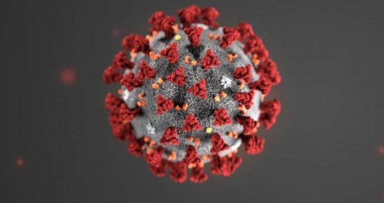

```{r setup, include=FALSE}
knitr::opts_chunk$set(echo = TRUE)
```

<p align="center">
<b>

</b><br>
</p>
  
  <p align="center">
  <b>Github Code: [Jun4871 Github](https://github.com/Jun4871/copy_with_R_book/blob/master/Klusterling.Rmd)</b><br>
</p>

# 개요

19년 12월 중국 우한에서 시작된 **코로나(COVID-19) 바이러스(일명 '우한 폐렴')**가 최근 국내에서도 크게 확산되었다. 이에 정부에서도 위기경보를 **'심각'** 수준으로 격상시킴과 동시에 범국민적 대응 중이나, 초기 진압에 실패한 댓가는 컸고 현재 대한민국은 전염병으로 인한 몸살을 앓고 있다. 국민들의 걱정과 불안을 대변이라도하듯 관련 여론은 빠르게 형성되었고, 그 중심에는 무엇이 있을지 파악해보기 위해 관련 기사들을 크롤링하여 분석해보았다. 


# 라이브러리 활성화 및 자료수집

```{r  message=FALSE, fig.align="center", fig.height=8, fig.width = 14}
# 필요한 라이브러리 활성화
library(rvest)
library(tidyverse)
library(KoNLP)
library(wordcloud)
library(RColorBrewer)
library(glue)
library(arules)
library(arulesViz)
```


```{r  message=FALSE,  results = FALSE, fig.align="center", fig.height=8, fig.width = 14}
# 데이터 전처리

keyword <- "코로나"

# page_number <- seq(1, 100, 10)  
page_number <- seq(1, 100, 10)

# map 함수 적용
map_news_urls <- map(page_number, function(x) {
  url <- glue("https://search.naver.com/search.naver?&where=news&query={keyword}&sm=tab_pge&sort=0&photo=0&field=0&reporter_article=&pd=0&ds=&de=&docid=&nso=so:r,p:all,a:all&mynews=0&cluster_rank=105&start={x}&refresh_start=0")
  
  news_urls <- url %>% 
    read_html() %>% 
    html_nodes(".news.mynews.section._prs_nws") %>% 
    html_nodes("._sp_each_url") %>% 
    html_attr("href")
  
  # 네이버 뉴스_index
  naver_news_index <- grep("https://news.naver.com/main", news_urls)
  
  # 네이버 뉴스 url만
  news_urls <- news_urls[naver_news_index]
}) %>% 
  unlist() %>% # 리스트에서 백터화
  unique()


news_text_set <- c()

for (i in 1:length(map_news_urls)) {
  news_text <- map_news_urls[i] %>%
    read_html() %>%
    html_nodes("#articleBodyContents._article_body_contents") %>%
    html_text()
  
  if(length(news_text) == 0) {
    text_set <- "내용 없음"
  }
  
  # 빈벡터에 뉴스 text를 하나씩 붙힘 
  news_text_set <- append(news_text, news_text_set)
  # Sys.sleep(1)
}


# 필요없는 문자열 제거
cleanging_data <- news_text_set %>% 
  str_remove_all("flash 오류를 우회하기 위한 함수 추가") %>% # 문자열 제거
  str_remove_all("function _flash_removeCallback") %>% 
  str_remove_all("[a-zA-Z]") %>% # 정규표현식 영어제거
  str_remove_all("\\d") %>% 
  str_remove_all("무단 전재 및 재배포 금지") %>% 
  str_remove_all("내용 없음") %>% 
  str_replace_all("\\W" , " ") # 정규표현식 : 문자가 아닌 것을 공백으로 변경


nouns <- map(cleanging_data,function(x) {
  # x 자리에 cleanging_data가 들어가 일괄적으로 처리함. 
 noun_data <- extractNoun(x) %>% 
   str_remove_all("은") %>% 
   str_remove_all("는") %>% 
   str_remove_all("가") %>% 
   str_remove_all("를") %>% 
   str_remove_all("일보")
 
 noun_data <- noun_data %>% 
   subset(nchar(noun_data) >= 2)
})


# 테이블 형태로 변환
word_count <- nouns %>% 
  unlist() %>% # 리스트를 벡터로 전환
  table() # 각 단어에 대한 빈도확인

# 편리하게 데이터 프레임으로 전환
df_word <- as.data.frame(word_count, stringsAsFactors = FALSE)

# 컬럼명 변경
colnames(df_word) <- c("word", "freq")

# 데이터 정제
word_freq <- df_word %>% 
  filter(freq >= 2) %>%
  arrange(desc(freq)) 


# 상위 n 개 데이터 파악
test_df <- word_freq %>% 
  top_n(20) %>% # 헤드함수와 같음
  select(word) %>% 
  t() %>%  # 행과 열의 위치 변경
  as.character()


item_list <- map(1:5, function(x){
  # x 자리에 1에서 5가 들어감.
  nouns[[x]] %>%
    subset(nouns[[x]] %in% test_df) %>%
    unique() %>%
    head(10)
})


# item의 트렌잭션화
item <- as(item_list, "transactions")

# apriori 함수 수행( 지지도 0.1, 신뢰도 0.8 이상인 연관성 규칙 구하기)
result_items <- apriori(item, parameter = list(support=0.1, confidence=0.8))
```


## 지지도 신뢰도를 기준으로 데이터 선정
뉴스 데이터를 명사화 하여 이를 기반으로 장바구니 분석을 시행한 결과 입니다. 여기서 파악해야 할 것은 Support, confidence, lift 입니다. 
 
 - Support(지지도): 두 항목 X와 Y의 지지도는 전체 거래 건수 중에서 항목집합 X와 Y를 모두 포함하는 거래 건수의 비율을 말합니다. 지지도는 좋은 규칙(빈도가 많은, 구성비가 높은)을 찾거나, 불필요한 연산을 줄일 때(pruning, 가지치기)의 기준으로 사용합니다.

 - Confidence(신뢰도): 항목집합 X를 포함하는 거래 중에서 항목집합 Y도 포함하는 거래 비율 (조건부 확률) 을 말합니다.  신뢰도가 높을 수록 유용한 규칙일 가능성 높다고 할 수 있습니다.

 - Lift(향상도): 항목집합 X가 주어지지 않았을 때의 항목집합 Y의 확률 대비 항목집합 X가 주어졌을 대 항목집합 Y의 확률 증가 비율을 말합니다. 다른말로 표현하자면, 향상도가 1보다 크거나(+관계) 작다면(-관계) 우연적 기회(random chance)보다 우수함을 의미합니다. (X와 Y가 서로 독립이면 Lift = 1)

```{r}
inspect(head(result_items, 50))
```


## 연관 규칙 시각화

본 시각화 자료는 키워드 간의 연관성을 네트워크 구조로 표현해보았다.

 - 단어와 단어사이의 원의 크기는 지지도를 나타내며, 원이 클 수록 두 단어 사이의 연관성이 높다고 볼 수 있다.

'확진', '판정', '대구' 등과 같은 단어들을 찾아볼 수 있고, lift 값이 높게 나온 것으로 보아 이것들에 대한 연관성은 단순 우연에 의해 만들어진 것이 아니라는 것으로 해석할 수 있다.  

```{r  message=FALSE, fig.align="center", fig.height=8, fig.width = 14}
set.seed(156)
plot(result_items[1:80], method = "graph")
```

## 워드 클라우드

단어의 빈도 별로 정리한 워드 클라우드이다. 각 단어의 크기는 단어사용 빈도수를 의미한다. 역시 '확진', '판정', '대구', '확진자' 등의 키워드가 높은 빈도로 사용되었음을 확인할 수 있다. 

```{r  message=FALSE }
set.seed(2)
wordcloud::wordcloud(words = word_freq$word, freq = word_freq$freq,
                     min.freq = 3, max.words = 200,
                     family="headline",
                     random.order = FALSE, rot.per = 0.1,
                     scale= c(3,0.5),
                     colors = "black")
```

## 빈도수의 바플롯화

 위 자료에 이어서 뉴스에서 사용된 단어와 빈도 차이를 막대 그래프 형식으로 표현해보았다. '확진자'라는 키워드가 1위, 그 뒤로 '대구', '뉴스' 가 각각 2위와 3위를 차지했다.

```{r  message=FALSE, fig.align="center", fig.height=8, fig.width = 14}
ggplot(head(word_freq,20), aes(x=reorder(word,freq),y=freq,fill=word),colour=gradient) +
  geom_col() +
  theme_bw() + 
  labs(x="",y="단어 빈도",title = paste0(keyword," 네이버 뉴스 단어 빈도")) + 
  coord_flip() + 
  theme(legend.position = "none") +
  theme(text = element_text(size=20),
        axis.text.x = element_text(angle=90, hjust=1))

```

# 결론

뉴스 기사들을 크롤링해서 단어별 연관성과 사용빈도 수를 확인해보았다. 평소에 키워드를 '코로나'로 설정하고 크롤링했다면, '코로나 맥주'관련 내용이 더 많이 나왔을 것 같다는 생각을 했었는데, 확실히 사태가 위중한 만큼 '전염병 코로나' 관련 내용들이 많이 나왔다. 특히 '확진자', '판정', '확진' 등위 단어가 많이 사용됐는데 기존 유사증세를 보이던 사람이 검사진행 단계에서 확진판정을 받은 경우가 적지 않고, 이것이 기사화 됨으로 인해 나온 결과로 해석할 수 있다. 


