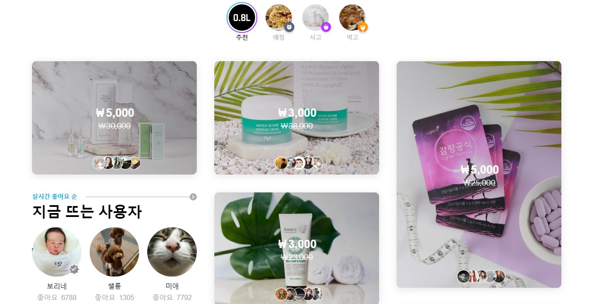
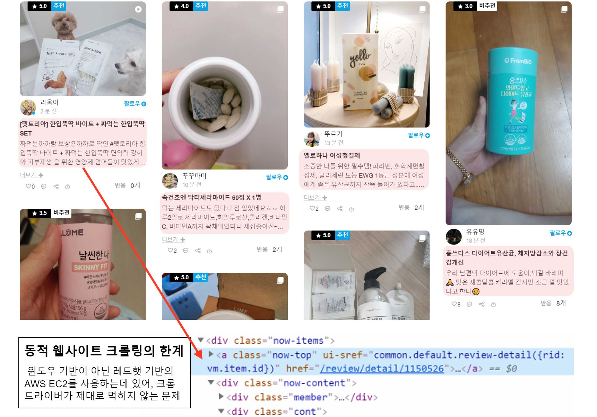

```{r setup, include=FALSE}
knitr::opts_chunk$set(echo = FALSE, message=FALSE, warning = FALSE, fig.align="center")
```


### 류경준
### 2020-02-27


# 공팔리터는?



경험 기반 소셜 커머스 회사로 **"세상의 모든 판매자와 세상의 모든 소비자를 직접 만나게 하면 어떨까?"** 라는 생각에서 출발하였으며, 고객이 SNS에 제품에 대한 리뷰를 남기는 대신 저렴한 비용으로 상품을 서비스로 제공하는 회사.


# 세간의 평가는 어떠한가? 

검색어 '공팔리터'와 관련된 네이버 뉴스기사들을 크롤링하여, 공팔리터를 중심으로 어떤 키워드들이 같이 기술이 되었는지를 확인하기 위해 연관성 분석을 진행해보았습니다. 

총 10페이지 분량의 기사들을 크롤링 하였습니다. 

```{r  message=FALSE, fig.align="center", fig.height=8, fig.width = 14}
# 필요한 라이브러리 활성화
library(rvest)
library(tidyverse)
library(KoNLP)
library(wordcloud)
library(RColorBrewer)
library(glue)
library(arules)
library(arulesViz)
```


```{r  message=FALSE,  results = FALSE, fig.align="center", fig.height=8, fig.width = 14}
# 데이터 전처리

keyword <- "공팔리터"

# page_number <- seq(1, 100, 10)  
page_number <- seq(1, 20, 10)

# map 함수 적용
map_news_urls <- map(page_number, function(x) {
  url <- glue("https://search.naver.com/search.naver?&where=news&query={keyword}&sm=tab_pge&sort=0&photo=0&field=0&reporter_article=&pd=0&ds=&de=&docid=&nso=so:r,p:all,a:all&mynews=0&cluster_rank=105&start={x}&refresh_start=0")
  
  news_urls <- url %>% 
    read_html() %>% 
    html_nodes(".news.mynews.section._prs_nws") %>% 
    html_nodes("._sp_each_url") %>% 
    html_attr("href")
  
  # 네이버 뉴스_index
  naver_news_index <- grep("https://news.naver.com/main", news_urls)
  
  # 네이버 뉴스 url만
  news_urls <- news_urls[naver_news_index]
}) %>% 
  unlist() %>% # 리스트에서 백터화
  unique()


news_text_set <- c()

for (i in 1:length(map_news_urls)) {
  news_text <- map_news_urls[i] %>%
    read_html() %>%
    html_nodes("#articleBodyContents._article_body_contents") %>%
    html_text()
  
  if(length(news_text) == 0) {
    text_set <- "내용 없음"
  }
  
  # 빈벡터에 뉴스 text를 하나씩 붙힘 
  news_text_set <- append(news_text, news_text_set)
  # Sys.sleep(1)
}


# 필요없는 문자열 제거
cleanging_data <- news_text_set %>% 
  str_remove_all("flash 오류를 우회하기 위한 함수 추가") %>% # 문자열 제거
  str_remove_all("function _flash_removeCallback") %>% 
  str_remove_all("[a-zA-Z]") %>% # 정규표현식 영어제거
  str_remove_all("\\d") %>% 
  str_remove_all("무단 전재 및 재배포 금지") %>% 
  str_remove_all("내용 없음") %>% 
  str_replace_all("\\W" , " ") # 정규표현식 : 문자가 아닌 것을 공백으로 변경


nouns <- map(cleanging_data,function(x) {
  # x 자리에 cleanging_data가 들어가 일괄적으로 처리함. 
 noun_data <- extractNoun(x) %>% 
   str_remove_all("은") %>% 
   str_remove_all("는") %>% 
   str_remove_all("가") %>% 
   str_remove_all("를") %>% 
   str_remove_all("일보")
 
 noun_data <- noun_data %>% 
   subset(nchar(noun_data) >= 2)
})


# 테이블 형태로 변환
word_count <- nouns %>% 
  unlist() %>% # 리스트를 벡터로 전환
  table() # 각 단어에 대한 빈도확인

# 편리하게 데이터 프레임으로 전환
df_word <- as.data.frame(word_count, stringsAsFactors = FALSE)

# 컬럼명 변경
colnames(df_word) <- c("word", "freq")

# 데이터 정제
word_freq <- df_word %>% 
  filter(freq >= 2) %>%
  arrange(desc(freq)) 


# 상위 n 개 데이터 파악
test_df <- word_freq %>% 
  top_n(20) %>% # 헤드함수와 같음
  select(word) %>% 
  t() %>%  # 행과 열의 위치 변경
  as.character()


item_list <- map(1:5, function(x){
  # x 자리에 1에서 5가 들어감.
  nouns[[x]] %>%
    subset(nouns[[x]] %in% test_df) %>%
    unique() %>%
    head(10)
})


# item의 트렌잭션화
item <- as(item_list, "transactions")

# apriori 함수 수행( 지지도 0.1, 신뢰도 0.8 이상인 연관성 규칙 구하기)
result_items <- apriori(item, parameter = list(support=0.1, confidence=0.8))
```


## 지지도 신뢰도를 기준으로 데이터 선정
뉴스 데이터를 명사화 하여 이를 기반으로 장바구니 분석을 시행한 결과 입니다. 여기서 파악해야 할 것은 Support, confidence, lift 입니다. 
 
 - Support(지지도): 두 항목 X와 Y의 지지도는 전체 거래 건수 중에서 항목집합 X와 Y를 모두 포함하는 거래 건수의 비율을 말합니다. 지지도는 좋은 규칙(빈도가 많은, 구성비가 높은)을 찾거나, 불필요한 연산을 줄일 때(pruning, 가지치기)의 기준으로 사용합니다.

 - Confidence(신뢰도): 항목집합 X를 포함하는 거래 중에서 항목집합 Y도 포함하는 거래 비율 (조건부 확률) 을 말합니다.  신뢰도가 높을 수록 유용한 규칙일 가능성 높다고 할 수 있습니다.

 - Lift(향상도): 항목집합 X가 주어지지 않았을 때의 항목집합 Y의 확률 대비 항목집합 X가 주어졌을 대 항목집합 Y의 확률 증가 비율을 말합니다. 다른말로 표현하자면, 향상도가 1보다 크거나(+관계) 작다면(-관계) 우연적 기회(random chance)보다 우수함을 의미합니다. (X와 Y가 서로 독립이면 Lift = 1)

```{r}
inspect(head(result_items, 20))
```


## 연관 규칙 시각화

본 시각화 자료는 키워드 간의 연관성을 네트워크 구조로 표현한 자료입니다. 

 - 단어와 단어사이의 원의 크기는 지지도를 나타내며, 원이 클 수록 두 단어 사이의 연관성이 높다고 볼 수 있습니다.

'공팔리터'를 중심으로 '소비자', '경험', '솔직' 등 경험 기반 연관 키워드로 나와있음을 확인 할 수 있습니다.

```{r  message=FALSE, fig.align="center", fig.height=8, fig.width = 14}
set.seed(200)
plot(result_items[1:80], method = "graph")
```

## 워드 클라우드

단어의 빈도 별로 워드 클라우드를 만들었습니다. 각 단어의 크기는 단어사용 빈도수를 의미합니다. 역시 '소비자', '리뷰', '상품' 등 공팔리터의 정체성을 나타내는 단어들이 많이 사용되었음을 알 수 있습니다.

```{r  message=FALSE }
set.seed(1)
wordcloud::wordcloud(words = word_freq$word, freq = word_freq$freq,
                     min.freq = 3, max.words = 200,
                     family="headline",
                     random.order = FALSE, rot.per = 0.1,
                     scale= c(3,0.5),
                     colors = "black")
```

## 빈도수의 바플롯화

 위 자료에 이어서 뉴스에서 사용된 단어와 빈도 차이를 막대 그래프 형식으로 나타내고 있습니다. 

```{r  message=FALSE, fig.align="center", fig.height=8, fig.width = 14}
ggplot(head(word_freq,20), aes(x=reorder(word,freq),y=freq,fill=word),colour=gradient) +
  geom_col() +
  theme_bw() + 
  labs(x="",y="단어 빈도",title = paste0(keyword," 네이버 뉴스 단어 빈도")) + 
  coord_flip() + 
  theme(legend.position = "none") +
  theme(text = element_text(size=20),
        axis.text.x = element_text(angle=90, hjust=1))

```


# 한계점




# 결론

'공팔리터' 라는 키워드로 네이버 뉴스 검색어의 단어 빈도를 나타내 보았습니다. 그리고 이 각 단어들이 어떻게 상호 작용을 하는지 장바구니 분석을 통해 알아보았습니다. **“세상의 모든 판매자와 세상의 모든 소비자를 직접 만나게 하면 어떨까?”** 라는 슬로건에 걸맞는 내용들이 많이 나와 있습니다. 주를 담당하는 키워드는 공팔리터, 소비자, 서비스, 솔직, 상품, 마케팅, 구매로 "소비자들의 솔직한 리뷰로 상품이 소개 되고 이는 동시에 다른 소비자로 연결 된다"는 공팔리터의 슬로건과 일치 하는 결과를 얻을 수 있었습니다.  
 아쉬운점이 있다면, 인스타그램, 유튜브에서도 열심히 마케팅을 하고 홍보를 하고 있음에도, 이러한 내용들이 기사화 되지 않았던점 입니다. 분석을 하기전에 초기 가설로는 공팔리터, 리뷰, 체험, 경험, 상품, 구매, 인스타, 유튜브, 마케팅 등의 키워드가 주로 모여 상위 빈도에 나올것이라 예상 했었으나 나오지 않았기 때문입니다. 
 한계점이 있었다면, 공팔리터의 공식사이트에서 각 유저들이 어떻게 제품에 대한 리뷰를 하는지를 텍스트마이닝으로 알아보려 했으나, 동적 웹사이트를 크롤링 하는데 있어서 셀레니움을 사용해야 한다는 문제가 있었습니다. 셀레니움을 사용하는데 크롬드라이버가 레드햇 기반인 AWS EC2에서 한계가 있어, 윈도우로 했어야 했습니다. 이를 해결하는데에 시간적인 무리가 있어, 정적인 네이버 뉴스를 가지고 어쩔수 없이 **오피셜**한 기사만을 가지고 분석을 했습니다. 

<br>

---

<br>


## 코드 

```
# 필요한 라이브러리 활성화
library(rvest)
library(tidyverse)
library(KoNLP)
library(wordcloud)
library(RColorBrewer)
library(glue)
library(arules)
library(arulesViz)

# 데이터 전처리
keyword <- "공팔리터"

# page_number <- seq(1, 100, 10)  
page_number <- seq(1, 20, 10)

# map 함수 적용
map_news_urls <- map(page_number, function(x) {
  url <- glue("https://search.naver.com/search.naver?&where=news&query={keyword}&sm=tab_pge&sort=0&photo=0&field=0&reporter_article=&pd=0&ds=&de=&docid=&nso=so:r,p:all,a:all&mynews=0&cluster_rank=105&start={x}&refresh_start=0")
  
  news_urls <- url %>% 
    read_html() %>% 
    html_nodes(".news.mynews.section._prs_nws") %>% 
    html_nodes("._sp_each_url") %>% 
    html_attr("href")
  
  # 네이버 뉴스_index
  naver_news_index <- grep("https://news.naver.com/main", news_urls)
  
  # 네이버 뉴스 url만
  news_urls <- news_urls[naver_news_index]
}) %>% 
  unlist() %>% # 리스트에서 백터화
  unique()


news_text_set <- c()

for (i in 1:length(map_news_urls)) {
  news_text <- map_news_urls[i] %>%
    read_html() %>%
    html_nodes("#articleBodyContents._article_body_contents") %>%
    html_text()
  
  if(length(news_text) == 0) {
    text_set <- "내용 없음"
  }
  
  # 빈벡터에 뉴스 text를 하나씩 붙힘 
  news_text_set <- append(news_text, news_text_set)
  # Sys.sleep(1)
}


# 필요없는 문자열 제거
cleanging_data <- news_text_set %>% 
  str_remove_all("flash 오류를 우회하기 위한 함수 추가") %>% # 문자열 제거
  str_remove_all("function _flash_removeCallback") %>% 
  str_remove_all("[a-zA-Z]") %>% # 정규표현식 영어제거
  str_remove_all("\\d") %>% 
  str_remove_all("무단 전재 및 재배포 금지") %>% 
  str_remove_all("내용 없음") %>% 
  str_replace_all("\\W" , " ") # 정규표현식 : 문자가 아닌 것을 공백으로 변경


nouns <- map(cleanging_data,function(x) {
  # x 자리에 cleanging_data가 들어가 일괄적으로 처리함. 
 noun_data <- extractNoun(x) %>% 
   str_remove_all("은") %>% 
   str_remove_all("는") %>% 
   str_remove_all("가") %>% 
   str_remove_all("를") %>% 
   str_remove_all("일보")
 
 noun_data <- noun_data %>% 
   subset(nchar(noun_data) >= 2)
})


# 테이블 형태로 변환
word_count <- nouns %>% 
  unlist() %>% # 리스트를 벡터로 전환
  table() # 각 단어에 대한 빈도확인


# 편리하게 데이터 프레임으로 전환
df_word <- as.data.frame(word_count, stringsAsFactors = FALSE)

# 컬럼명 변경
colnames(df_word) <- c("word", "freq")


# 데이터 정제
word_freq <- df_word %>% 
  filter(freq >= 2) %>%
  arrange(desc(freq)) 


# 상위 n 개 데이터 파악
test_df <- word_freq %>% 
  top_n(20) %>% # 헤드함수와 같음
  select(word) %>% 
  t() %>%  # 행과 열의 위치 변경
  as.character()


item_list <- map(1:5, function(x){
  # x 자리에 1에서 5가 들어감.
  nouns[[x]] %>%
    subset(nouns[[x]] %in% test_df) %>%
    unique() %>%
    head(10)
})


# item의 트렌잭션화
item <- as(item_list, "transactions")

# apriori 함수 수행( 지지도 0.1, 신뢰도 0.8 이상인 연관성 규칙 구하기)
result_items <- apriori(item, parameter = list(support=0.1, confidence=0.8))

# Graph
set.seed(200)
plot(result_items[1:80], method = "graph")

# Wordcloud
set.seed(1)
wordcloud::wordcloud(words = word_freq$word, freq = word_freq$freq,
                     min.freq = 2, max.words = 200,
                     family="headline",
                     random.order = FALSE, rot.per = 0.1,
                     scale= c(5,0.5),
                     colors = "black")

# ggplot 
ggplot(head(word_freq,20), aes(x=reorder(word,freq),y=freq,fill=word),colour=gradient) +
  geom_col() +
  theme_bw() + 
  labs(x="",y="단어 빈도",title = paste0(keyword," 네이버 뉴스 단어 빈도")) + 
  coord_flip() + 
  theme(legend.position = "none") +
  theme(text = element_text(size=20),
        axis.text.x = element_text(angle=90, hjust=1))
```
